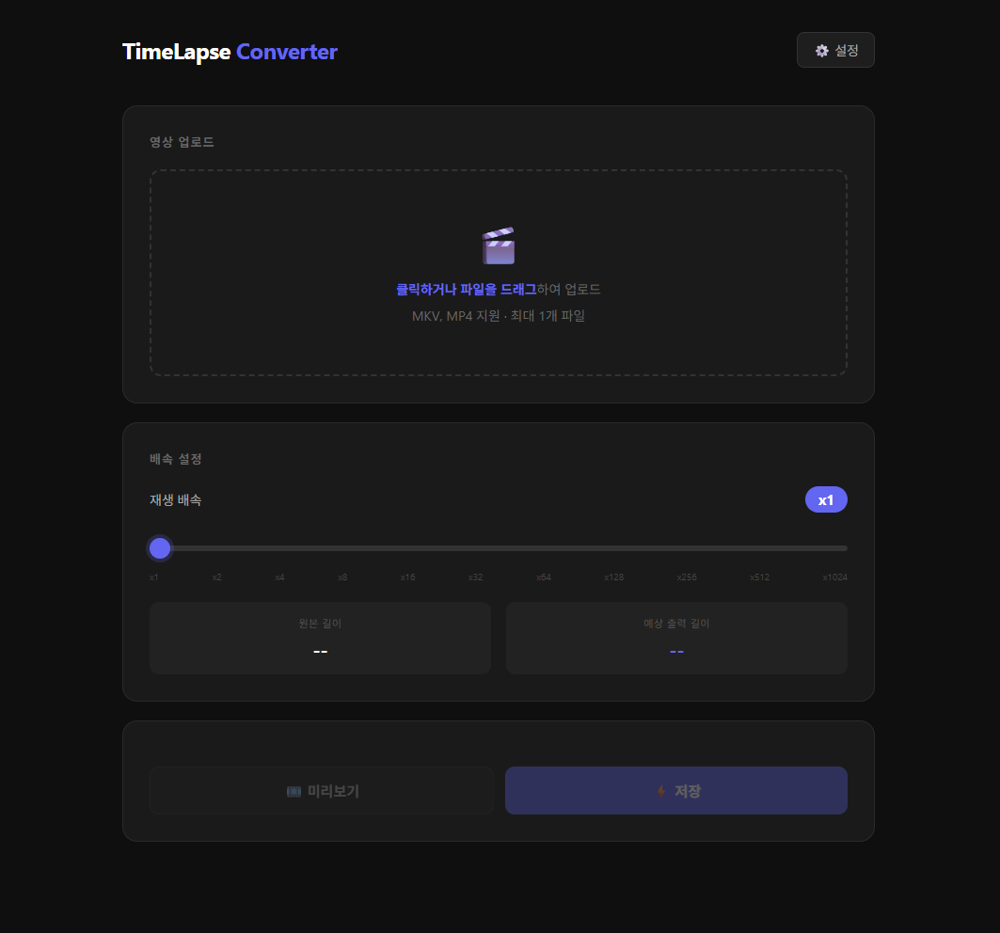

# 🎬 TimeLapse Converter

OBS로 녹화한 장시간 영상을 타임랩스 형태로 빠르게 압축해주는 로컬 웹 애플리케이션입니다.
유튜브 브이로그, 인스타그램 피드/스토리 등 SNS 2차 활용을 목적으로 제작되었습니다.

---

## 📋 목차

- [개요](#개요)
- [화면](#화면)
- [기술 스택](#기술-스택)
- [주요 기능](#주요-기능)
- [사전 요구사항](#사전-요구사항)
- [설치 및 실행](#설치-및-실행)
- [사용 방법](#사용-방법)
- [설정](#설정)
- [주의사항](#주의사항)
- [향후 개선 예정](#향후-개선-예정)

---

## 개요

- OBS Studio로 녹화한 1~12시간 분량의 `.mkv` / `.mp4` 영상을 업로드
- 원하는 배속(x1 ~ x1024)을 선택하여 10초~수십 초 분량으로 압축
- 오디오는 자동 제거, 원본 해상도 유지, MP4(H.264) 포맷으로 출력

---

## 화면



---

## 기술 스택

| 항목 | 내용 |
|------|------|
| Language | Java 17 |
| Framework | Spring Boot 3.5.11 |
| Build Tool | Gradle (Groovy) |
| Template Engine | Thymeleaf |
| 영상 처리 엔진 | FFmpeg (CUDA 하드웨어 가속) |
| 실행 방식 | 로컬 웹 서버 (내장 Tomcat) |
| 접근 방법 | 브라우저에서 `http://localhost:8100` 접속 |

---

## 주요 기능

### 1. 영상 업로드
- `.mkv`, `.mp4` 파일 지원
- 최대 1개 파일 업로드 (클릭 또는 드래그 앤 드롭)
- 업로드 후 원본 영상 길이 자동 표시

### 2. 배속 설정
- x1, x2, x4, x8, x16, x32, x64, x128, x256, x512, x1024 총 11단계
- 단계식 슬라이더로 선택
- 배속 선택 시 예상 출력 길이 실시간 표시

### 3. 미리보기
- 원본 영상 앞 30초를 추출하여 미리보기 제공
- 브라우저 재생속도 조절 방식 (별도 변환 없이 즉각 반응)
- x16 초과 배속 선택 시 브라우저 한계로 미리보기는 x16으로 재생 (실제 저장은 선택 배속 적용)
- 미리보기 구간 길이: 30초 (고정)

### 4. 최종 변환 및 저장
- NVIDIA CUDA 하드웨어 가속(h264_nvenc) 적용으로 빠른 변환
- 오디오 자동 제거
- 출력 포맷: MP4 (H.264), 원본 해상도 유지, CRF 18
- 변환 중 실시간 진행률 표시 (SSE 방식)
- 변환 완료 후 저장 경로 표시

### 5. 설정
- 출력 파일 저장 경로 변경 가능 (기본값: `C:/timelapse-output`)

---

## 사전 요구사항

### 1. Java 17
```bash
java -version
```

### 2. FFmpeg 설치
```bash
ffmpeg -version
```
설치되어 있지 않다면 [FFmpeg 공식 빌드](https://github.com/BtbN/FFmpeg-Builds/releases)에서 다운로드 후 환경변수 PATH에 등록

**설치 경로 예시:**
```
C:\ffmpeg\bin\ffmpeg.exe
```
**환경변수 PATH 등록:**
```
C:\ffmpeg\bin
```

### 3. NVIDIA GPU 및 드라이버 (CUDA 가속 사용 시)
- NVIDIA GPU 필요 (GTX 1650 이상 권장)
- **드라이버 570.0 이상** 필요 (미만 버전은 h264_nvenc 미지원)
- CUDA 지원 여부 확인:
```bash
ffmpeg -hwaccels
# 결과에 'cuda' 가 있으면 사용 가능
```

> ⚠️ NVIDIA 드라이버가 570.0 미만이면 변환 시 오류가 발생합니다. 드라이버 업데이트 또는 `VideoService.java` 에서 CPU 인코딩으로 변경이 필요합니다.

---

## 설치 및 실행

### 1. 프로젝트 클론
```bash
git clone https://github.com/your-repo/timelapse.git
cd timelapse
```

### 2. 빌드
```bash
./gradlew build
```

### 3. 실행
```bash
./gradlew bootRun
```
또는 IntelliJ에서 `TimeLapseApplication.java` 의 main 메서드 실행

### 4. 브라우저 접속
```
http://localhost:8100
```

---

## 사용 방법

1. 브라우저에서 `http://localhost:8100` 접속
2. 영상 파일(`.mkv` 또는 `.mp4`)을 업로드 영역에 드래그하거나 클릭하여 업로드
3. 배속 슬라이더로 원하는 배속 선택 → 예상 출력 길이 확인
4. **미리보기** 버튼으로 앞 30초 미리 확인
5. **저장** 버튼 클릭 → 진행률 확인 후 변환 완료
6. 설정된 출력 경로에서 변환된 파일 확인

---

## 설정

`src/main/resources/application.properties` 에서 설정 변경 가능

```properties
# 서버 포트
server.port=8100

# 업로드 파일 최대 크기
spring.servlet.multipart.max-file-size=50GB
spring.servlet.multipart.max-request-size=50GB

# 기본 출력 경로
app.output.path=C:/timelapse-output

# FFmpeg 실행 파일 경로
app.ffmpeg.path=ffmpeg
```

출력 경로는 브라우저 화면 우측 상단 **⚙️ 설정** 버튼에서도 변경 가능합니다.

---

## 주의사항

### 임시 파일 관련
- 업로드된 원본 파일과 미리보기 파일은 PC 임시 폴더에 저장됩니다
- 경로: `C:\Users\사용자명\AppData\Local\Temp\timelapse\`
- **서버 재시작 시 임시 폴더가 자동으로 비워집니다**
- 변환 중 서버를 종료하면 출력 파일이 0바이트로 남을 수 있으니 변환 완료 후 종료하세요

### 대용량 파일 관련
- 12시간짜리 영상은 업로드에 수 분이 소요될 수 있습니다
- 변환 시간은 영상 길이와 PC 성능에 따라 20분~1시간 이상 소요될 수 있습니다
- 변환 중 브라우저를 닫아도 서버가 실행 중이라면 변환은 계속 진행됩니다

### CUDA 관련
- NVIDIA 드라이버 570.0 미만이면 변환이 실패합니다
- CUDA를 사용하지 않으려면 `VideoService.java` 의 `convertVideo` 메서드에서 아래와 같이 수정하세요

```java
// CUDA 가속 제거 후 CPU 인코딩으로 변경
ProcessBuilder pb = new ProcessBuilder(
    videoConfig.getFfmpegPath(),
    "-y",
    "-i", currentUploadedFilePath,
    "-vf", "setpts=PTS/" + speed,
    "-an",
    "-crf", "18",
    "-preset", "fast",
    outputPath
);
```

### 출력 파일 관련
- 출력 파일명은 `원본파일명_배속x.mp4` 형식으로 생성됩니다
- 예: `2026-02-26 12-56-45_64x.mp4`
- 동일한 파일명이 이미 존재하면 덮어씁니다

---

## 향후 개선 예정

- [ ] 미리보기 구간 길이 설정 기능 (현재 고정 30초)
- [ ] 출력 CRF 값 UI에서 조절 기능
- [ ] 출력 FPS 설정 기능 (용량 절감)
- [ ] 변환 완료 후 데스크탑 알림
- [ ] 서버 종료 시 임시 파일 자동 정리

---

## License

MIT License
